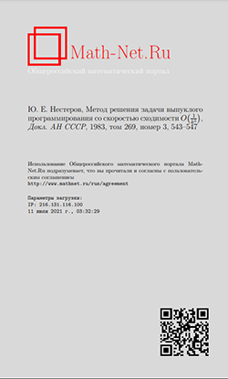

# nesterov-convex-programming-1983

The following repository contains my work-in-progress, computer-assisted English translation of the following paper, originally published in Russian:

[Nesterov, Y. E. (1983). A method of solving a convex programming problem with convergence rate O(1/k^2). (Russian). *Doklady Akademii Nauk SSSR, 269*(3), 543–547.](http://www.mathnet.ru/php/archive.phtml?wshow=paper&jrnid=dan&paperid=46009&option_lang=eng)

Some remarks about the rationale for undertaking to upload an English translation of this paper. My studies in deep learning covered an extremely well-known technique known as *Nesterov's accelerated gradient method*, which originated in the above paper. While this paper is freely available and easily accessible online at the above link, it is in Russian. According to this thread at MathOverflow, an English translation of this paper exists as:

Nesterov, Yu. E. A method of solving a convex programming problem with convergence rate 0(1/k2). (English. Russian original) Zbl 0535.90071 Sov. Math., Dokl. 27, 372-376 (1983); translation from Dokl. Akad. Nauk SSSR 269, 543-547 (1983).

And it is available through interlibrary loan. However, this is difficult for me to get hold of where I live.

Despite this work having had a fair number of citations, as well as a strong influence on the convex optimisation and deep learning literature, it seems a strange state of affairs that it is not available in English online.

This repository aims to remedy that state of affairs.

## Directory structure.

1. `nesterov-method-convex-1983.pdf` - original paper in Russian.

2. `nesterov-method-convex-english-1983.md` - work-in progress English translation in Markdown format.

3. `nesterov-method-convex-english-1983.pdf` - work-in progress English translation in PDF format.

## Computer-assisted translation and roadmap.

I do not speak Russian. Following a suggestion on MathOverflow, I decided to use a combination of DeepL and Google Translate to translate the sections in Russian. My contribution, hopefully with assistance from a community, would be to proofread and appropriately amend the prose of the DeepL and Google Translate output; followed by a  proofreading of the mathematics and considered treatment of the technical semantics.

Here is a roadmap:

1. Computer translate the document using DeepL and Google Translate, and port to PDF using Pandoc.

2. Check fidelity of mathematical transcription.

3. Render prose from computer translation into good English.

4. Update formatting e.g. paragraphing.

5. Technical proof-reading, consisting of parsing the mathematical arguments for correctness and possible typos in the original manuscript; as well as the technical parts of the translation.

6. Typeset in LaTeX. Currently working in Markdown because I prefer it to LaTeX.

7. Author and journal copyright permissions.

8. Publish to arXiV.

